## Overview

This project is a **web-based personnel management system** developed in Laravel as part of a university coursework. It is designed for managing **faculty and student records**, handling user roles and access, and providing administrative functionalities for a department.


## Features

* **Access Management**
  Control user roles and permissions to ensure proper access throughout the system.

  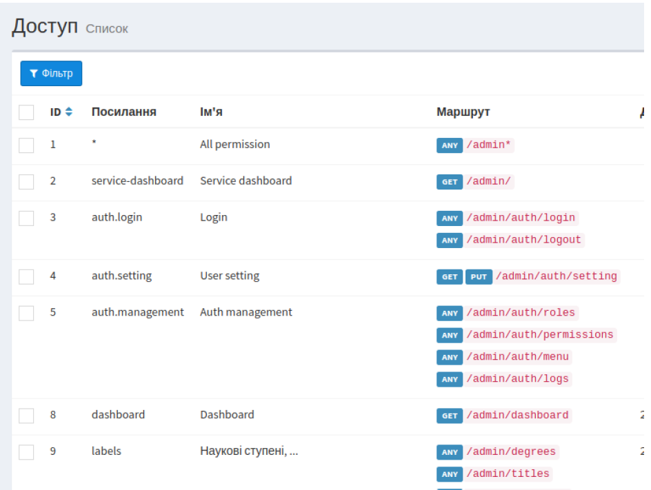

* **Dashboard**
  View key statistics such as the number of faculty members, students, and scientific works issued.

  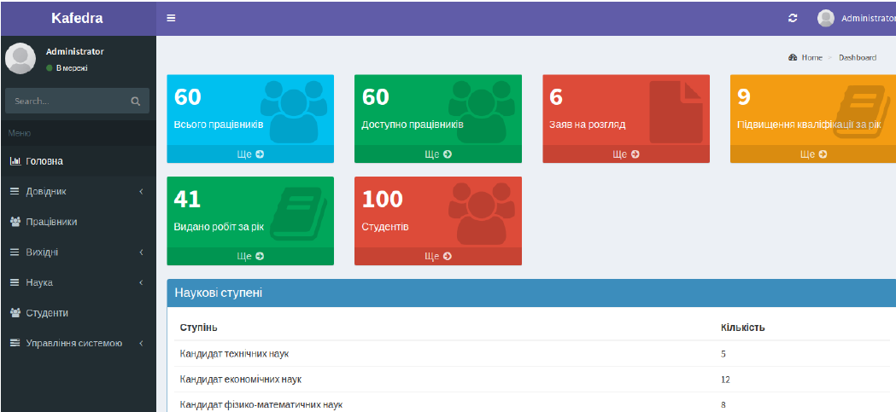

* **Employee Search & List**
  Search and browse faculty members with detailed information for each employee.

  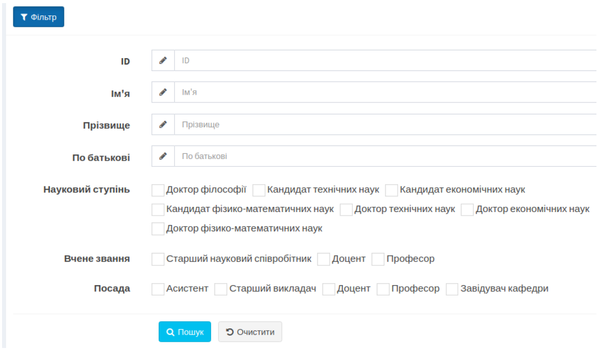

  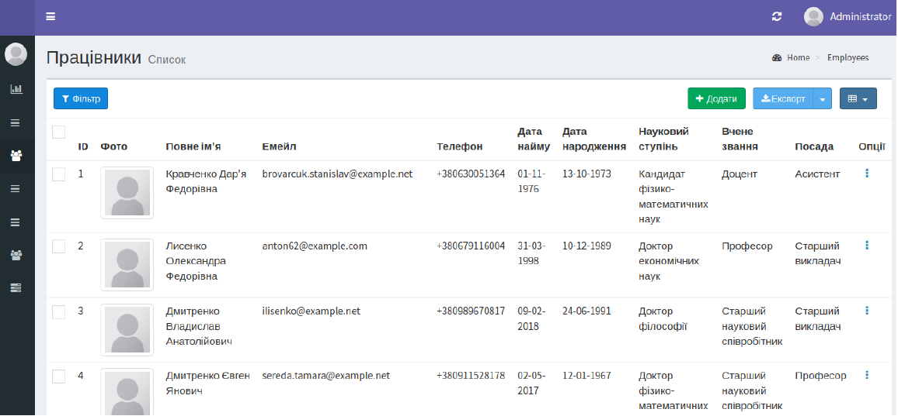

* **Employee / User Edit & Settings**
  Manage user profiles and system settings.

  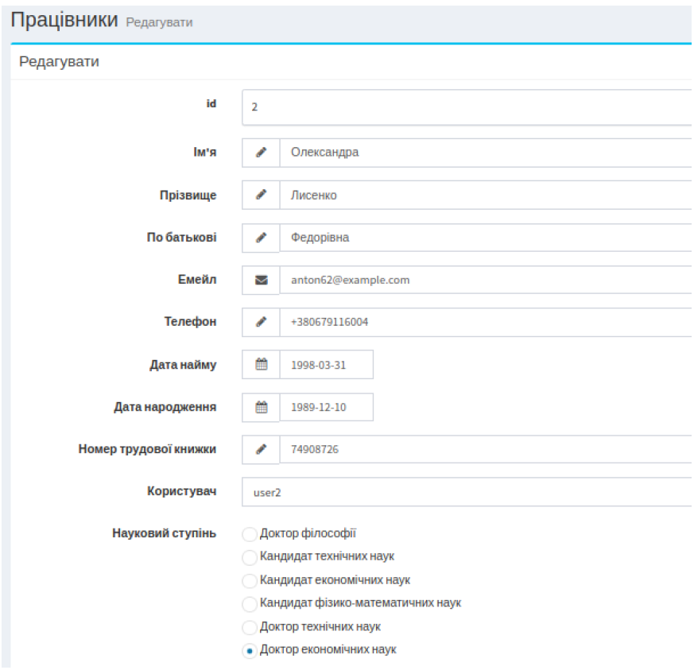

  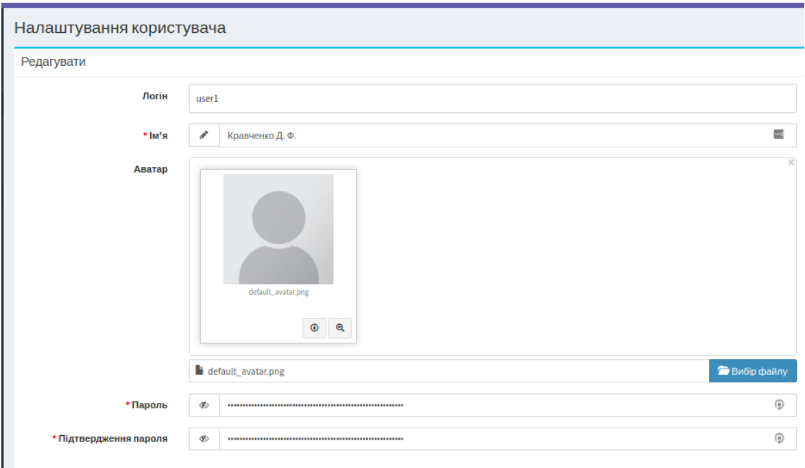

* **Menus & Directories**
  Manage system menus and reference data like academic degrees or roles.

  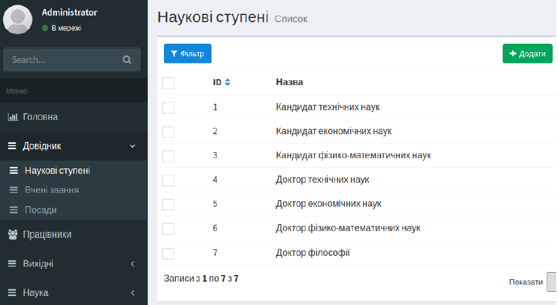

  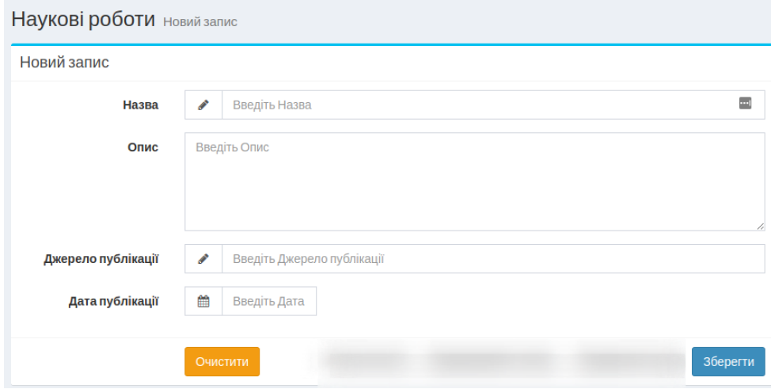

* **Statistics**
  Visualize distribution of faculty members by rank, department, or other metrics.

  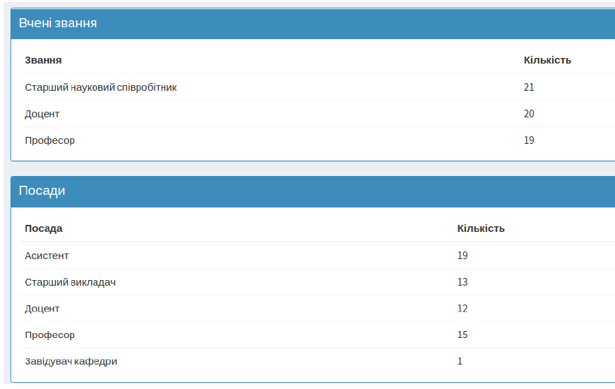

* **Vacations & Calendar**
  Manage employee leave requests, view vacations in calendar view, and track time-off periods.

  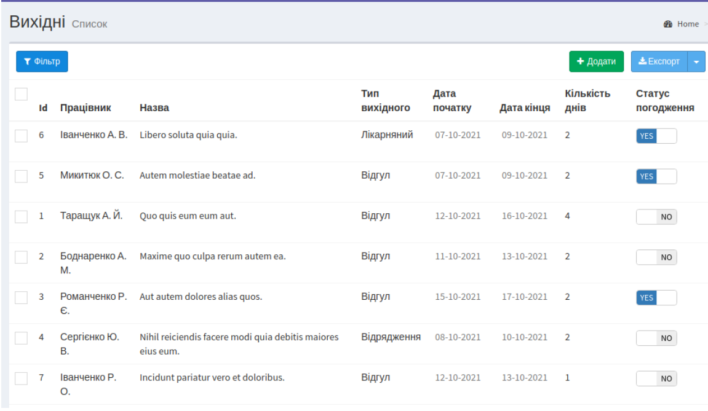

  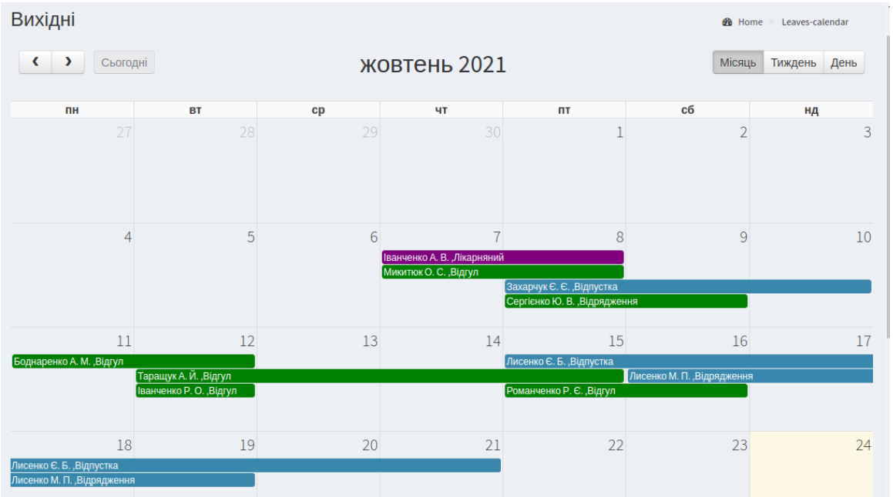

* **Student Management**
  Browse and manage student records associated with the department.

  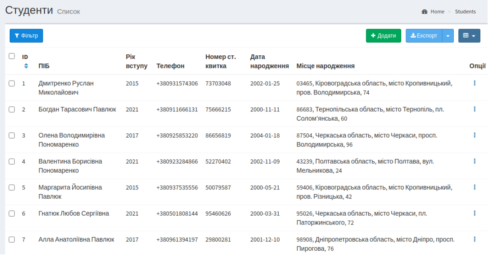


## Installation Guide

### Requirements

* PHP 7.3 or higher
* MySQL

### Steps

1. **Clone the repository**

   ```bash
   git clone <repository-url>
   cd <repository-folder>
   ```

2. **Set up environment file**

   ```bash
   cp .env.example .env
   ```

   Then, edit the `.env` file to set your database credentials:

   ```env
   DB_CONNECTION=mysql
   DB_HOST=127.0.0.1
   DB_PORT=3306
   DB_DATABASE=your_database_name
   DB_USERNAME=your_database_user
   DB_PASSWORD=your_database_password
   ```

3. **Generate application key**

   ```bash
   php artisan key:generate
   ```

4. **Run database migrations and seed data**
   This will create tables and populate them with initial data:

   ```bash
   php artisan migrate --seed
   ```

### Default Credentials

**Admin:**

* Login: `admin`
* Password: `admin`

**Users:**

* Login: `user1`, `user2`, ...
* Password: `password`
